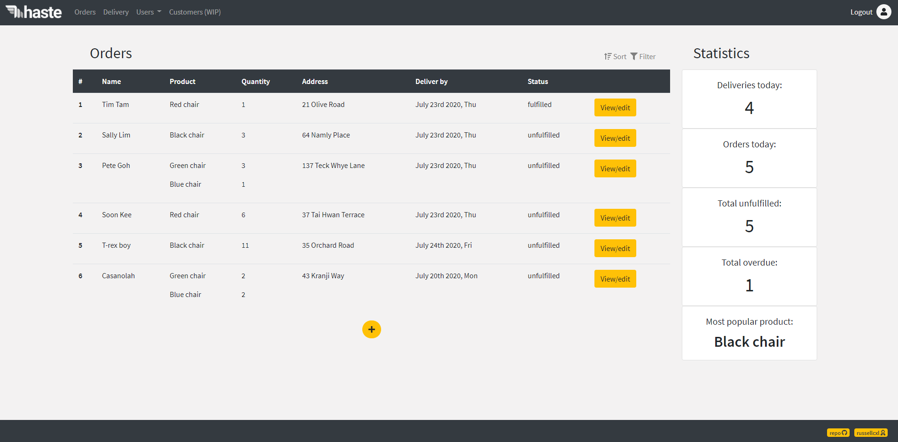
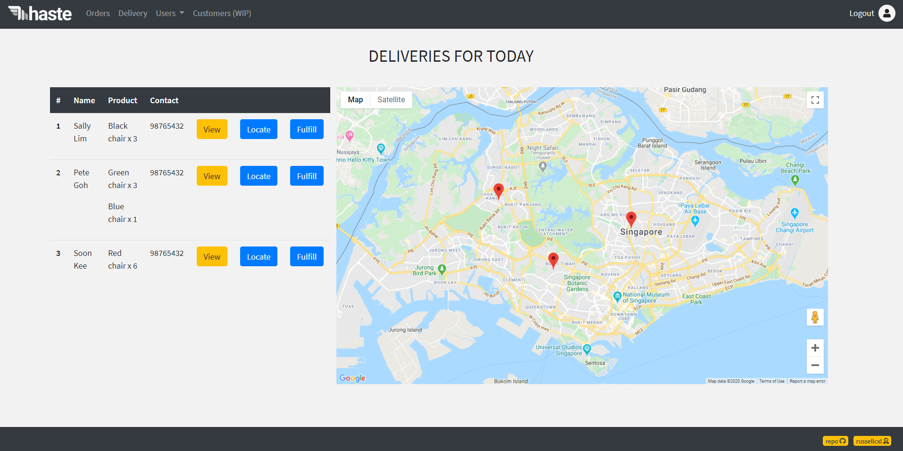
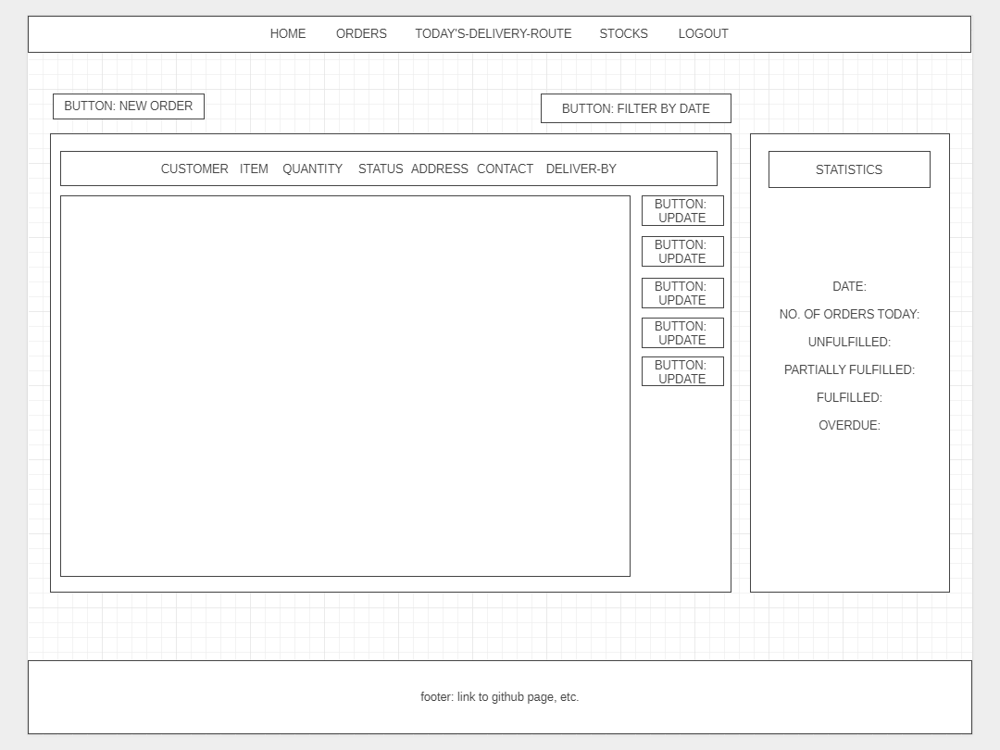

# Haste
## Streamlining the order/delivery process for your company's needs

This is will be a delivery system that processes orders and maps out the most efficient delivery path for the day. 

### Motivation
Some friends own a small business selling gaming chairs. However, because there is no proper order/delivery system, they do things very manually (and inefficiently) i.e. filter the order entries according to the day's date, write all the delivery addresses on a piece of paper, map their route, and go about the deliveries.

This app hopes to automate that process, by retrieving orders from their platform's database every day or half.

### Technologies applied:
- Nodejs
- Express
- EJS
- Momentjs
- Passportjs
- Google Maps
- ConnectFlash
- Axios
- Bcrypt
- Bootstrap

### Features:

The index page will display all orders. The headers can be adjusted according to whatever is the database and its fields.

The view/edit buttons are only accessible by verified user i.e. the staff.


The delivery page displays all orders due on that day. Again, there are buttons to view the order in more detail, locate the order on the map as well as to fulfill the order quickly.

I may withdraw the key for Google Maps in the future, so you may find that the map does not display.

### Future plans:
I hope to allow the app to make requests for information from databases and parse that information accordingly.

I also hope to turn this into a mobile app, or at least have it viewable on a mobile screen, since it is almost certain that whoever has to use this app will be using it while on the go.

Other improvements/fixes to be made:
- Validate address/postal
- Include a product database to keep track of stocks
- Set user location

### Wireframe


### Data-storage:
```js
Admin/staff = {
    name
    email
    password
}

Order = {
    customer
    products + qty
    status
    delivery date
}

Customer = {
    name
    phone
    address
    postal
    orders
}
```


